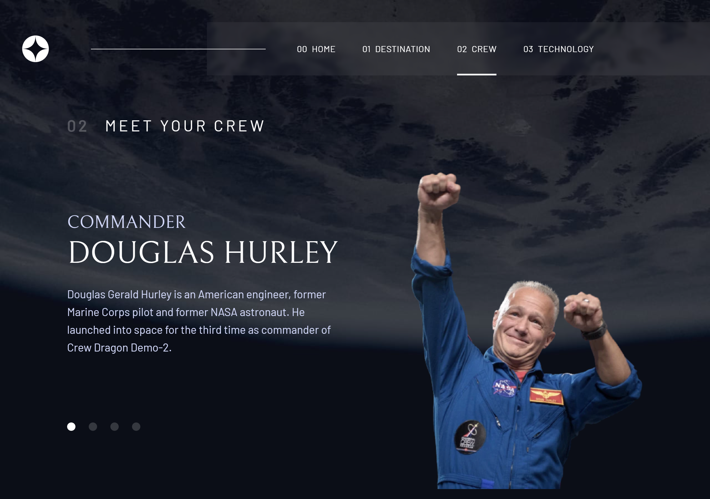

# Frontend Mentor - Space tourism website solution

This is a solution to the [Space tourism website challenge on Frontend Mentor](https://www.frontendmentor.io/challenges/space-tourism-multipage-website-gRWj1URZ3). Frontend Mentor challenges help you improve your coding skills by building realistic projects.

## Table of contents

- [Overview](#overview)
  - [The challenge](#the-challenge)
  - [Screenshots](#screenshots)
  - [Links](#links)
- [My process](#my-process)
  - [Built with](#built-with)
- [Author](#author)

## Overview

### The challenge

Users should be able to:

- View the optimal layout for each of the website's pages depending on their device's screen size
- See hover states for all interactive elements on the page
- View each page and be able to toggle between the tabs to see new information

### Screenshots

### Links

- Solution URL: [view solution](https://github.com/Headbwoi/space-tourism-website)
- Live Site URL: [live-site](https://space-tourism-website-et-moi.netlify.app/)

## My process

### Built with

- Semantic HTML5 markup
- Flexbox
- Mobile-first workflow
- [TailwindCSS](https://tailwindcss.com/) - For styles
- [React](https://reactjs.org/) - JS library
- React Router
- [Framer Motion](https://framer.com/) - React framework

## Author

- Frontend Mentor - [@Headbwoi](https://www.frontendmentor.io/profile/yourusername)
- Twitter - [@Headbwoi_1](https://www.twitter.com/Headnwoi_1)
